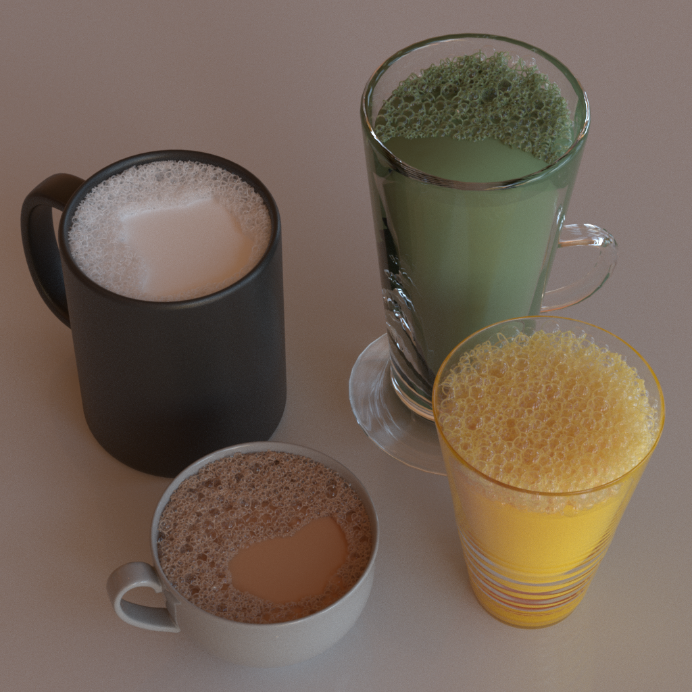
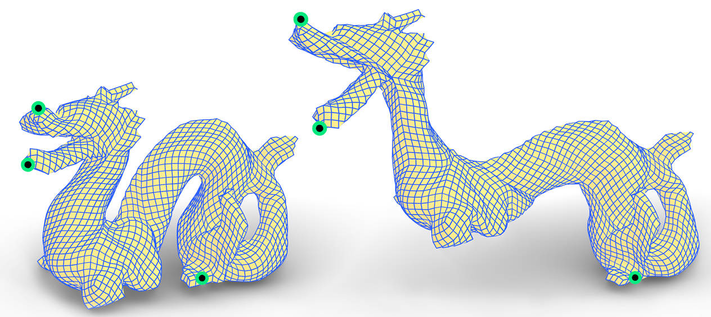

I am currently a Ph.D. student at the University of Science and Technology of China (USTC), advised by Prof. [Ligang Liu](http://staff.ustc.edu.cn/~lgliu/). I also collaborate with Prof. [Beibei Wang](https://wangningbei.github.io/) on research projects. Previously, I received my Bachelor's degree from USTC in 2021. My research interests lie in rendering in computer graphics, and I am currently working on material modeling for realistic rendering.

Publications
=====

  <!-- 左侧图片 -->
  

  <!-- 右侧内容 -->

  

    <h3 style="margin: 0;">
      <a href="https://projectpage.com" target="_blank" style="text-decoration: none; color: black;">
        Bidirectional Plateau-Border Scattering Distribution Function for Realistic and Efficient Foam Rendering.
      </a>
    </h3>
    
<strong>Authors:</strong> Ruizeng Li, Xinyang Liu, Runze Wang, <a href="https://jerry-shen0527.github.io/">Pengfei Shen</a>, <a href="http://staff.ustc.edu.cn/~lgliu/">Ligang Liu</a>, <a href="https://wangningbei.github.io/">Beibei Wang</a>.

    
<em>Proc. The 36th Eurographics Symposium on Rendering (EGSR), 2025. </em>

    

      <a href="../BPSDF/paper.pdf">Paper</a> |
      <a href="../BPSDF/Supplementary.pdf">Supplementary</a>
    

  

  <!-- 左侧图片 -->
  

  <!-- 右侧内容 -->
  

    <h3 style="margin: 0;">
      <a href="https://wangningbei.github.io/2023/DiffGlints.html" target="_blank" style="text-decoration: none; color: black;">
        Scratch-based Reflection Art via Differentiable Rendering.
      </a>
    </h3>
    
<strong>Authors:</strong> <a href="https://jerry-shen0527.github.io/">Pengfei Shen</a>, Ruizeng Li, <a href="https://wangningbei.github.io/">Beibei Wang</a>, <a href="http://staff.ustc.edu.cn/~lgliu/">Ligang Liu</a>.

    
<em>ACM Transactions on Graphics (Proc. SIGGRAPH), 42(4), Article 65: 1–12, 2023.</em>

    

      <a href="../DiffScratch/paper_diffGlints_compressed.pdf">Paper</a> |
      <a href="../DiffScratch/supplementary_diffGlints.pdf">Supplementary</a> |
      <a href="../DiffScratch/video_diffGlints_compressed.mp4">Video</a>
    

  

  <!-- 左侧图片 -->
  

  <!-- 右侧内容 -->
  

    <h3 style="margin: 0;">
        Interactive Editing of Discrete Chebyshev Nets.
    </h3>
    
<strong>Authors:</strong> Ruizeng Li, <a href="https://mangoleaves.github.io/">Jia-Peng Guo</a>, Qi Wang, <a href="https://kfckfckf.github.io/">Shuangming Chai</a>, <a href="http://staff.ustc.edu.cn/~lgliu/">Ligang Liu</a>, <a href="http://staff.ustc.edu.cn/~fuxm/">Xiao-Ming Fu</a>.

    
<em>Computer Graphics Forum (Proc. Eurographics), 41(2), 2022.</em>

    

      <a href="../EditChebyshev/2022_EditChebyshev.pdf">Paper</a> |
      <a href="../EditChebyshev/EditChebyshev-supp.pdf">Supplementary</a> |
      <a href="../EditChebyshev/compress_edit-cheby-result.mp4">Video</a> |
      <a href="../EditChebyshev/edit-cheby-presentation-video.mp4">Presentation</a>
    

  

